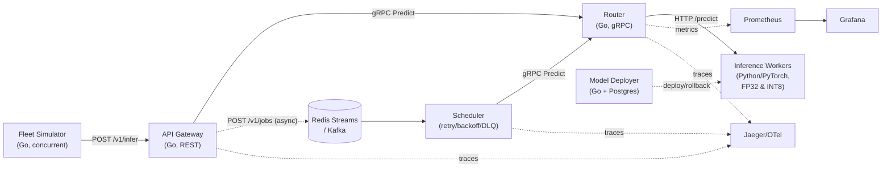

# TeslaEdge

**A distributed AI inference and fleet-learning platform** — Go microservices
for routing/scheduling/gateway/registry, PyTorch models for perception,
trajectory prediction and driving-event classification, real (not invented)
quantization and load-test benchmarks, and a full Docker Compose /
Kubernetes / Prometheus+Grafana+OpenTelemetry deployment story.

Built as a portfolio project demonstrating Go, distributed systems, ML
infrastructure, model optimization, and production ML engineering — modeled
on fleet-scale AI inference problems, **not** a reproduction of any real
company's actual technology or data.

## Problem statement

A fleet of vehicles needs low-latency ML inference (driving-event
classification, trajectory prediction, obstacle perception) served by a pool
of heterogeneous workers (different precisions, different hardware), with
requests intelligently routed, model versions safely deployed and rolled
back, distribution drift detected, and the whole system observable end to
end. That's a distributed-systems problem as much as an ML problem — which
is why this repo is majority Go (routing, scheduling, gateway, registry)
with PyTorch doing exactly the part only PyTorch should: training and
running the models.

## Architecture



Full diagram, data flow walkthrough, and dataset methodology:
[docs/architecture.md](docs/architecture.md). Why each piece is shaped the
way it is, alternatives considered, and what was traded off:
[docs/design-decisions.md](docs/design-decisions.md).

## How the Go services communicate

| From → To | Protocol | Why |
|---|---|---|
| Fleet Simulator / clients → Gateway | REST (JSON over HTTP) | Public-facing, simple, cacheable/inspectable |
| Gateway → Router | gRPC | Internal, high-frequency, low-overhead |
| Scheduler → Router | gRPC | Same contract as Gateway's synchronous path |
| Gateway → Scheduler | Redis Streams or Kafka (`shared/pkg/queue.Queue`) | Async, durable, retryable |
| Router → Inference Workers | REST (JSON over HTTP) | Cross-language (Go↔Python), trivially inspectable |
| Model Deployer ↔ Postgres | `pgx` | Transactional registry writes |
| All services → Prometheus | `/metrics` (Prometheus exposition format) | Pull-based scraping |
| All services → Jaeger | OTLP/gRPC (OpenTelemetry) | Distributed tracing |

## Repository layout

```
shared/                  Go module: proto, domain models, config/log/metrics/tracing/queue
services/
  gateway-go/             REST API gateway: auth, rate limiting, sync + async inference entry
  router-go/               gRPC inference router: worker registry + selection
  scheduler-go/            Async job dispatcher: queue consumer, retry/backoff/DLQ
  fleet-simulator-go/      Concurrent goroutine fleet of simulated vehicles
  model-deployer-go/       Model registry API (Postgres-backed): deploy/rollback/traffic-split
ml/
  common/                 Synthetic telemetry/trajectory data generation
  training/               Training scripts (event classifier, trajectory, perception)
  evaluation/             Standalone model evaluation against fresh holdout data
  quantization/           Real FP32/FP16/INT8 benchmarking
  perception/, trajectory/  Model architectures + synthetic frame generation + real FTSC dataset loader
  pipelines/              Drift detection + retrain-and-promote pipeline
  serving/                FastAPI inference worker (loads a trained model, serves /predict)
models/                  Trained model artifacts + metrics (checked in — see below)
benchmarks/              Load-test tool (Go) + real benchmark JSON output
deployments/
  docker/                 Per-service Dockerfiles
  kubernetes/              Deployment/Service/HPA manifests + kustomization
monitoring/               Prometheus scrape config, Grafana dashboard + provisioning
tests/
  ml/                      pytest suite for the ML pipeline
docs/                    architecture.md, design-decisions.md, benchmarks.md
.github/workflows/       Go CI, Python CI, Docker build CI
```

## Model architecture

| Model | Architecture | Input | Output |
|---|---|---|---|
| `event_classifier` | 3-layer MLP (5→32→32→4) | 5-dim telemetry (speed, accel, steering, jerk, noise) | 4-class driving event |
| `trajectory` | 1-layer LSTM (hidden=32) + linear head | 10-step (x,y) position history | Next (x,y) position |
| `perception` (synthetic) | 2-conv-layer CNN + FC head | 1x32x32 grayscale frame | 3-class (clear / obstacle far / obstacle near) |
| `perception_real` | same CNN, 3-channel/64px variant | 3x64x64 RGB traffic-sign photo | 6-class real sign category |

All are deliberately small — the point is demonstrating the surrounding ML
infrastructure (routing, quantization, versioning, drift detection), not
chasing state-of-the-art accuracy. `event_classifier` and `trajectory` train
on procedurally generated synthetic data; `perception_real` trains on
**[FTSC](https://github.com/andrewcaunes/FTSC)**, a real public dataset of
10,959 vehicle-camera traffic-sign photographs (CC BY-NC 4.0 — used here
non-commercially, with attribution). GTSRB on Kaggle was the first choice —
see [why it isn't the one shipped here](docs/architecture.md#dataset-methodology)
and `ml/perception/download_gtsrb_kaggle.py` if you want to swap it in
yourself. See [docs/architecture.md#dataset-methodology](docs/architecture.md#dataset-methodology)
for the full methodology.

## Results (real, measured — not invented)

| | |
|---|---|
| Event classifier accuracy / macro-F1 | 0.996 / 0.982 |
| Trajectory prediction (avg displacement error) | 0.42 m |
| Perception (synthetic task) accuracy / macro-F1 | 1.000 / 1.000 (trivial by design — see caveat in benchmarks doc) |
| **Perception on real data** (FTSC, real traffic signs) accuracy / macro-F1 | **0.869 / 0.844** |
| INT8 vs FP32 model size | 6.59 KB vs 8.50 KB (-22%) |
| INT8 vs FP32 batched throughput | 3.82M vs 2.17M samples/s (+76%) |
| End-to-end load test, 1 worker | 480.7 req/s, p50 99ms, 0 failures / 9,614 requests |
| End-to-end load test, 2 workers | 606.0 req/s, p50 89ms, 0 failures / 12,119 requests |
| Retry/DLQ behavior | Verified by test: 3 attempts → 1 dead-lettered job |
| Drift detection | Correctly flagged 2/5 shifted features, ignored 3/5 unshifted (KS test, α=0.01) |

Full numbers, methodology, and honest limitations (e.g. INT4 wasn't
benchmarked because there's no CPU kernel for it in this environment):
**[docs/benchmarks.md](docs/benchmarks.md)**.

## Failure cases / known limitations

- **INT8 quantization was *slower* than FP32 for single-sample latency** on
  this tiny (~1.4K-parameter) model — quantize/dequantize overhead dominates
  at this scale. Documented, not hidden: see
  [docs/benchmarks.md](docs/benchmarks.md#quantization-benchmark-fp32--fp16--int8).
- **FP16 shows no benefit on CPU** — expected, since x86 CPUs largely
  emulate FP16 rather than running it natively; would look very different on
  a GPU with tensor cores.
- **INT4 is not benchmarked at all** — no CPU kernel available without
  GPU-oriented libraries this environment doesn't have. A fabricated number
  would be worse than an honest gap.
- **The serving worker has no dynamic batching or warm pool** — each
  `/predict` call runs a single-sample forward pass; see
  [Future improvements](#future-improvements).
- **`docker compose up` / K8s manifests are config-validated, not
  live-deployed, in the environment this repo was built in** — that
  sandbox's network policy blocks Docker Hub image pulls entirely. Every Go
  service, the full Python ML pipeline, and the complete request path
  (gateway → router → worker, sync and async) *were* run and verified
  natively (binaries + `python3` directly, with local Redis/Postgres) — see
  [Reproducing this yourself](#reproducing-this-yourself). Treat
  `docker compose up` on a normal machine as the next thing to verify, not
  as already proven here.
- **GTSRB (Kaggle) was the intended real perception dataset; FTSC (GitHub)
  is what actually ships.** The same sandbox network policy that blocks
  Docker Hub also returns `403 Forbidden` for Kaggle and every Hugging Face
  host — confirmed by directly testing each one, not assumed. GitHub-hosted
  data was reachable, so FTSC (a real, CC BY-NC 4.0 licensed traffic-sign
  photo dataset) was used instead, and a ready-to-run GTSRB download script
  (`ml/perception/download_gtsrb_kaggle.py`) is provided for anyone with
  Kaggle access who wants to swap it in.

## Deployment instructions

### Local dev (Docker Compose)

```bash
docker compose up --build
# Gateway:        http://localhost:8080
# Model Deployer:  http://localhost:8081
# Prometheus:      http://localhost:9099
# Grafana:         http://localhost:3000  (admin / teslaedge, or anonymous viewer)
# Jaeger UI:       http://localhost:16686
```

This starts Redis, Postgres, Jaeger, Prometheus, Grafana, all five Go
services, and two ML workers (FP32 + INT8). Add `--profile kafka` to also
start Kafka and set `QUEUE_BACKEND=kafka` on `gateway`/`scheduler` to use it
instead of Redis Streams.

### Kubernetes

```bash
kubectl apply -k deployments/kubernetes/
```

Builds referenced as `teslaedge/<service>:latest` — build and push them
first (or point `imagePullPolicy`/image tags at your registry). Includes an
HPA on the gateway and two ML-worker Deployments (FP32/INT8) so the
router's precision-aware selection has real heterogeneous workers to choose
between.

### Training models from scratch

```bash
pip install -r ml/requirements.txt
python3 ml/training/train_event_classifier.py --version v1
python3 ml/training/train_trajectory.py --version v1
python3 ml/training/train_perception.py --version v1
```

## API examples

```bash
# Synchronous inference (Gateway -> Router -> Worker)
curl -X POST http://localhost:8080/v1/infer \
  -H "Content-Type: application/json" -H "X-API-Key: devkey" \
  -d '{
    "vehicle_id": "vehicle-1",
    "model_name": "driving-event-classifier",
    "precision": "fp32",
    "priority": "normal",
    "features": [80, -6.5, 25, 0.1, 0.2]
  }'
# => {"request_id":"...","worker_id":"worker-1","model_version":"v1",
#     "predicted_label":"near_collision","confidence":0.9999,"latency_ms":9}

# Asynchronous job (Gateway -> Redis/Kafka -> Scheduler -> Router -> Worker)
curl -X POST http://localhost:8080/v1/jobs \
  -H "Content-Type: application/json" -H "X-API-Key: devkey" \
  -d '{"vehicle_id":"vehicle-2","model_name":"driving-event-classifier","features":[60,0.1,1,0,0]}'
# => {"job_id":"..."}   (result published to the "inference.results" stream/topic)

# Model registry: register, deploy, rollback, canary traffic split
curl -X POST http://localhost:8081/v1/models/register -H "Content-Type: application/json" \
  -d '{"model_name":"event_classifier","version":"v1","precision":"fp32","artifact_path":"models/event_classifier/v1/model_fp32.pt","metrics":{"accuracy":0.996}}'
curl -X POST http://localhost:8081/v1/models/event_classifier/deploy -H "Content-Type: application/json" -d '{"version":"v1","reason":"initial launch"}'
curl -X POST http://localhost:8081/v1/models/event_classifier/rollback -H "Content-Type: application/json" -d '{"reason":"regression found"}'
curl -X POST http://localhost:8081/v1/models/event_classifier/traffic -H "Content-Type: application/json" -d '{"version":"v2","traffic_pct":10}'
curl http://localhost:8081/v1/models/event_classifier/production
```

## Reproducing this yourself

Everything under [docs/benchmarks.md](docs/benchmarks.md) is reproducible
with the exact commands listed at the top of each section — no step
requires infrastructure beyond what's in this repo (Redis, Postgres, and
Go/Python toolchains). In order:

```bash
# 1. Go services build & test
go build ./... && go vet ./... && go test ./...   # run inside each services/*/ and shared/

# 2. Train and evaluate all models (synthetic + real)
python3 ml/training/train_event_classifier.py --version v1
python3 ml/training/train_trajectory.py --version v1
python3 ml/training/train_perception.py --version v1
python3 ml/training/train_perception_real.py --version v1 --epochs 10 --limit 4000  # downloads FTSC, ~233MB, first run only
python3 ml/evaluation/evaluate.py --model event_classifier --version v1

# 3. Quantization benchmark
python3 ml/quantization/benchmark.py --version v1

# 4. Drift detection
python3 ml/pipelines/drift_detection.py --version v1

# 5. End-to-end load test (needs Redis + Postgres + the Go binaries + a worker running — see docker-compose.yml for the exact env vars each needs)
go run ./benchmarks/loadtest -url http://localhost:8080 -concurrency 50 -duration 20s -api-key devkey

# 6. Python unit tests
python3 -m pytest tests/ml -v
```

## Monitoring

Prometheus scrapes all five Go services (`monitoring/prometheus/prometheus.yml`);
Grafana auto-provisions a "TeslaEdge Overview" dashboard
(`monitoring/grafana/provisioning/dashboards/json/teslaedge-overview.json`)
covering fleet telemetry rate, inference success/error rate, gateway
latency percentiles, and scheduler job outcomes (processed/failed/retried/
dead-lettered). OpenTelemetry traces propagate Gateway → Router → Scheduler
and export to Jaeger (`OTEL_EXPORTER_OTLP_ENDPOINT`, defaults to stdout if
unset). No dashboard screenshots are included in this repo — take one after
running `docker compose up` and generating traffic; the provisioning is
what's verified here, not a static image of it.

## Future improvements

- Dynamic batching and a warm worker pool in `ml/serving/server.py` (today:
  one synchronous forward pass per request).
- Real shadow-traffic/canary comparison using the registry's existing
  `traffic_pct` field, instead of `retrain_and_promote.py`'s offline
  accuracy-delta gate (see
  [design-decisions.md](docs/design-decisions.md#promotion-gate-accuracy-delta-threshold-not-a-full-canaryshadow-pipeline)
  for why that gate is honest about its own limits).
- Redis Streams' `XCLAIM`-based redelivery sweep for messages left pending
  by a crashed consumer (noted as a gap in `shared/pkg/queue/redis.go`).
- mTLS between services instead of the current in-cluster-trust assumption.
- A real vehicle-camera dataset in place of `ml/perception`'s synthetic
  frames, once one is available to train on.
- GPU workers + INT4 quantization benchmarks once GPU hardware is available
  (the routing/registry/precision plumbing already supports it end to end;
  only the actual GPU worker and INT4 kernel are missing).

## License

Portfolio project. Not affiliated with, endorsed by, or representing the
technology of any real company.
