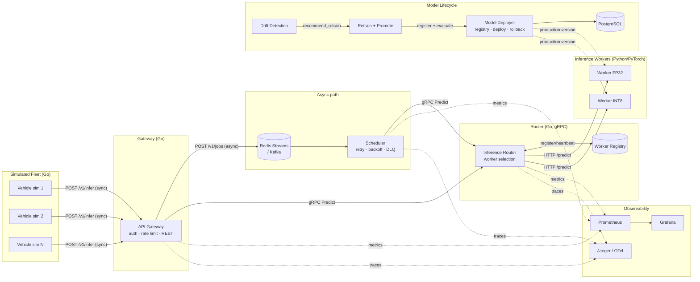

# TeslaEdge Architecture

## System diagram

## Why this shape

**Two request paths, on purpose.** A vehicle's onboard driving-event
classifier needs a synchronous answer in tens of milliseconds — `/v1/infer`
goes straight from Gateway to Router to Worker with no queue in the way.
Batch/retraining/lower-priority work goes through `/v1/jobs`, which enqueues
onto Redis Streams (or Kafka) and lets the Scheduler apply retry/backoff/
dead-lettering without holding an HTTP connection open. Putting a queue in
front of *every* request would add latency the synchronous path can't
afford; skipping the queue for async work would lose retry semantics. Two
paths, each suited to its own latency/durability tradeoff.

**Why gRPC between Gateway/Scheduler and Router, but plain HTTP from Router
to Workers.** The Router's `InferenceService` (see
`shared/proto/inference/v1/inference.proto`) is internal, high-frequency,
Go-to-Go (and Go-to-Python for registration) traffic — gRPC's binary framing
and streaming (`StreamPredict`) fit that. The Router-to-worker hop is
deliberately plain JSON-over-HTTP: it's the one cross-language boundary
where keeping the contract trivially inspectable (`curl` a worker's
`/predict` directly) outweighs gRPC's efficiency, and it means adding a
worker in a language with poor gRPC tooling is still a two-endpoint job
(`/predict`, `/healthz`).

**Why the queue backend is an interface, not a hard Kafka/Redis choice.**
`shared/pkg/queue.Queue` is implemented three ways — Redis Streams
(default), Kafka (`segmentio/kafka-go`), and in-memory (tests). The
scheduler and gateway only import the interface. This mirrors a real
platform decision point: Redis Streams is operationally lighter for a
single-cluster deployment; Kafka's partitioned log and consumer-group
rebalancing earn their complexity at genuine multi-region/multi-consumer
scale. `QUEUE_BACKEND=kafka` is a one-line config change, not a rewrite.

**Why the Router picks workers instead of a client-side/DNS load balancer.**
Worker selection here needs signals a load balancer doesn't have: which
workers actually support the requested model, whether a worker's max
precision satisfies the request, and current in-flight load per worker (see
`services/router-go/internal/routing/selector.go`). A generic L4/L7 LB
can't make a "this request needs FP32, that worker only serves INT8"
decision. Centralizing that logic in one Go service also makes it directly
testable and benchmarkable in isolation (`selector_test.go`,
`BenchmarkSelect`), instead of buried in infra config.

**Why the model registry is a separate service with its own Postgres,
not a table the Router reads directly.** Deploy/rollback/traffic-split are
infrequent, consistency-sensitive writes (a deploy must atomically demote
the old production version and promote the new one — see
`registry.Deploy`'s transaction). Inference routing is high-frequency reads
that must never block on a lock held by a deploy. Splitting them into
separate services means a slow registry write can never add latency to the
inference hot path, and the registry's schema can evolve independently of
the router's in-memory worker table.

## Data flow: one inference request, end to end

1. A simulated vehicle (`fleet-simulator-go`) posts a 5-feature telemetry
   sample to `POST /v1/infer` on the Gateway.
2. Gateway checks the API key, applies the token-bucket rate limiter, and
   calls Router's `Predict` RPC over gRPC.
3. Router snapshots its live worker registry (heartbeat within the last 30s),
   filters to workers that (a) support `driving-event-classifier` and (b)
   meet the requested precision, then scores the rest by latency + in-flight
   load (+ a GPU bonus for critical-priority requests) and picks the best one.
4. Router POSTs the feature vector to that worker's `/predict` over HTTP.
5. The worker (Python/PyTorch) normalizes the features, runs the loaded
   model, and returns the predicted class + confidence.
6. Router returns the result to Gateway, which returns it to the caller —
   and updates the worker's observed latency for the next routing decision.

Total measured round trip in this environment: ~90-100ms p50 under load (see
[benchmarks.md](benchmarks.md#load-test-results)) — dominated by
Python/uvicorn overhead, not the ~0.04ms the model itself takes to run.

## Dataset methodology

TeslaEdge has no access to a real vehicle fleet, sensor logs, or camera
footage — and presenting fabricated "real" data would misrepresent what this
project actually demonstrates. Instead, `ml/common/synthetic_data.py` and
`ml/perception/synthetic_frames.py` procedurally generate:

- **Telemetry** (`generate_driving_events`): Gaussian-noise speed/accel/
  steering with physically-motivated thresholds (hard braking = large
  negative acceleration, lane change = large steering angle) plus explicit
  event injection so all four classes appear with reasonable frequency.
- **Trajectories** (`generate_trajectories`): constant-velocity-plus-curvature
  paths with positional noise, standing in for a vehicle's recent GPS/IMU
  history.
- **Camera frames** (`generate_frames`): synthetic 32x32 grayscale frames —
  background noise vs. a Gaussian "blob" at two size/contrast levels,
  standing in for near/far obstacle detection.

Every generator is seeded and documented as synthetic in its own docstring
and in [benchmarks.md](benchmarks.md#model-training-results).

**Perception was subsequently re-evaluated on a real public dataset.**
Synthetic frames were the right starting point for validating the pipeline
end to end quickly, but they cap out at a trivial signal-detection problem
(100% accuracy, see benchmarks). `ml/perception/real_dataset.py` and
`ml/training/train_perception_real.py` train the same `PerceptionCNN`
architecture on **[FTSC (French Traffic Sign Classification)](https://github.com/andrewcaunes/FTSC)**
— 10,959 real photographs of French traffic signs cropped from vehicle-mounted
cameras in Antony, France, in varying weather and lighting, licensed
**CC BY-NC 4.0** (non-commercial use with attribution, which is exactly this
project's use). Real-world result: **86.9% accuracy / 84.4% macro-F1** across
6 sign categories (regulatory, informative, danger, temporary, "not in
catalogue", other) — a genuinely imperfect, class-imbalance-affected number,
which is a more honest demonstration of a trained model than the synthetic
task's 100%. See [benchmarks.md](benchmarks.md#model-training-results) for
the full per-class breakdown.

[GTSRB](https://www.kaggle.com/datasets/meowmeowmeowmeowmeow/gtsrb-german-traffic-sign)
(German Traffic Sign Recognition Benchmark) — the field's most widely-cited
traffic-sign dataset — was the first choice, but Kaggle and every Hugging
Face host (main site, CDN, `datasets-server`) returned `403 Forbidden` from
the sandbox this project was developed in, the same network restriction that
blocks Docker Hub (see the README's [known limitations](../README.md#failure-cases--known-limitations)).
GitHub-hosted content was reachable, which is how FTSC was found and used
instead. `ml/perception/download_gtsrb_kaggle.py` is provided, ready to run
on a machine with Kaggle API access, for anyone who wants to swap GTSRB in —
`PerceptionCNN`'s architecture already supports it unchanged (it's
parameterized by channel count, image size and class count for exactly this
reason).

A real deployment would replace the telemetry/trajectory generators'
outputs with actual fleet telemetry the same way — the Go services, routing
logic, registry, and monitoring stack downstream of them would not need to
change.
